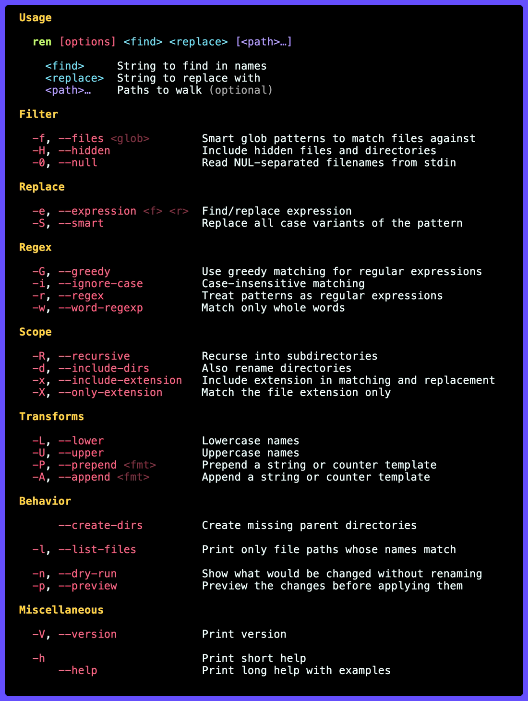

# ren

`ren` is a fast bulk file renamer, sibling of [`rep`](https://github.com/gechr/rep).

Where `rep` rewrites file *contents*, `ren` rewrites file *names*. Plain and regex find/replace, smart preserve-case rewrites, an interactive preview, glob filters, dry runs, listing, and multiple `-e/--expression` rewrites in a single pass.

## Install

```shell
brew install gechr/tap/ren
```

Or with Cargo:

```shell
cargo install --git https://github.com/gechr/ren
```

## Usage



## Examples

```sh
# Replace `foo` with `bar` anywhere in basenames (cwd, files only)
ren foo bar

# Recurse into subdirectories
ren -R foo bar

# Also rename matching directories
ren --include-dirs foo bar

# Restrict to .rs files
ren -f rs old new

# Stem-only matching is the default (api_v1.json -> api_v2.json)
ren v1 v2

# Include extensions in matching and replacement
ren -x rs txt

# Match only the extension; preserve the stem (foo.rs -> foo.txt)
ren -X rs txt

# Smart-rename across case variants
#   foo_bar -> hello_world, FooBar -> HelloWorld, FOO_BAR -> HELLO_WORLD, ...
ren --smart foo_bar hello_world

# Regex rename: replace test_ prefix with spec_
ren --regex '^test_' 'spec_'

# Interactive preview before applying
ren --preview foo bar

# Plan only, don't touch the filesystem
ren --dry-run foo bar

# Preview the plan, accept/reject entries, then print (not apply)
ren --preview --dry-run foo bar

# Apply multiple replacements in a single pass
ren -e foo bar -e baz qux

# Print matching paths only (no rename)
ren -l foo

# Case-only rename (works on case-insensitive filesystems too)
ren tmp TMP

# Number every file in cwd: 01_alpha.txt, 02_beta.txt, ... (smart per-dir width)
ren --prepend '{N}_'

# Custom counter format with explicit zero-padding and a path scope
ren --prepend='{n:03}_' src/

# Number files as a suffix on the stem: foo.txt -> foo-1.txt, ...
ren --append '-{n}'

# Lowercase every basename in cwd
ren --lower

# Compose: find/replace, then lowercase, then append, then prepend
ren --prepend '{N}_' --lower foo bar
```

## Transforms

When `<find> <replace>` alone isn't enough, transforms layer over the find/replace stage. They're optional, compose with each other, and make `<find> <replace>` itself optional too - so `ren --prepend '{N}_'` is a valid invocation.

| Flag                    | Effect                                        |
| ----------------------- | --------------------------------------------- |
| `-L`, `--lower`         | lowercase the basename (mutex with `--upper`) |
| `-U`, `--upper`         | uppercase the basename                        |
| `-P`, `--prepend <fmt>` | prepend a literal string or template          |
| `-A`, `--append <fmt>`  | append a literal string or template           |

Counter templates (recognised inside both `--prepend` and `--append`):

- `{n}` - the 1-based per-parent-directory index (`1`, `2`, `3`, …).
- `{n:0WIDTH}` - zero-padded to `WIDTH` digits (`{n:03}` → `001`, `002`, …).
- `{N}` - smart-width: zero-padded to `max(2, len(dir_count))`. So a directory with under 100 entries gets `01`, `02`, …; 100+ gets `001`, `002`, …; 1000+ gets `0001`, `0002`, …. Pick this when you don't want to count by hand.

Anything else in the format string passes through, so `[{n:02}]-`, `chapter-{n:03}_`, `-{n}` all work as written. Both affixes share the same per-record counter, so `--prepend '{n}-' --append '-{n}'` produces `1-foo-1`, `2-bar-2`, …. Values that start with `-` need the `=`-attached form (e.g. `--append='-{n}'`) so they aren't mistaken for flags.

The pipeline runs in fixed canonical order regardless of argv order:

1. find/replace (positional or `-e`)
2. `--lower` *or* `--upper`
3. `--append`
4. `--prepend`

By default the pipeline runs on the file stem only and the extension is reattached afterward - this prevents accidents like `ren txt notes` rewriting `report.txt` to `report.notes`. `-x/--include-extension` opts back into matching the full basename, and `-X/--only-extension` flips the split so the pipeline runs on the extension only and the stem is preserved verbatim. Counter indexes reset per parent directory - with `--recursive`, each directory starts at `1` (or `01`, `001`, … with a width specifier). Files filtered out by find/replace don't consume a counter slot.

## Preview keymap

`ren --preview` walks each plan entry and asks for a decision:

| Key | Action                                    |
| --- | ----------------------------------------- |
| `y` | accept this rename                        |
| `n` | reject this rename                        |
| `A` | accept this and all remaining renames     |
| `q` | stop prompting and apply accepted renames |
| `←` | go back and revise the previous decision  |
| `→` | skip this rename                          |

Combine with `--dry-run` to walk the prompts without touching the filesystem.
